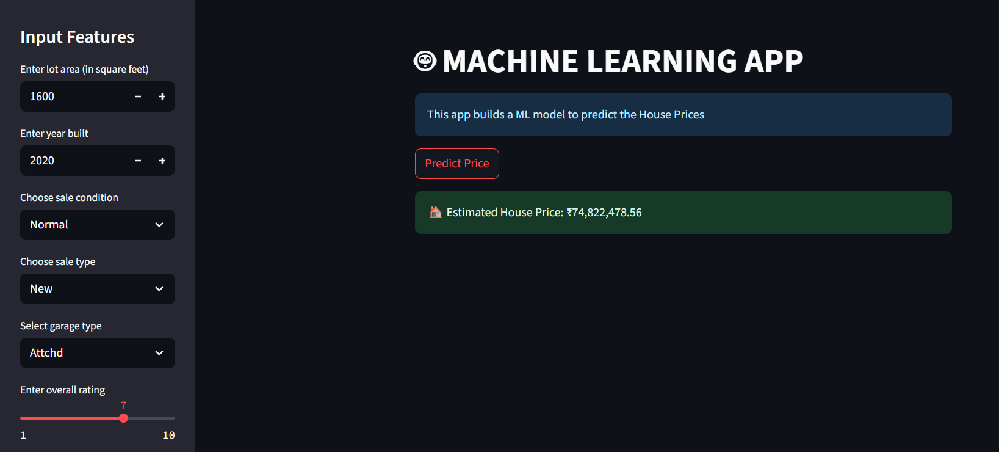

# House Price Prediction Web App

This project uses a **Linear Regression** model to predict house prices based on selected features such as `LotArea`, `SaleCondition`, `SaleType`, `OverallQual`, `YearBuilt`, and `GarageType`.  
It is deployed as an interactive **Streamlit** web application.

---

## Overview

 **Goal**: Predict house prices using user-provided inputs.  
 **Model Used**: Linear Regression  
 **Framework**: Streamlit – used to create an interactive and responsive web application  
 **Backend/ML**: Python, Scikit-learn  
 **Dataset**: [Ames House Prices Dataset](https://www.kaggle.com/competitions/house-prices-advanced-regression-techniques/data)

---

## Live Demo

[Click here to try the app](https://housepricepredictorsimple.streamlit.app/)

---

## How It Works

1. User provides house features via the web form.
2. Categorical variables are encoded using `encoder.pkl`.
3. The trained model (`LR_HPP.pkl`) makes the prediction.
4. The predicted price is displayed, along with optional visualizations.

---

## Screenshots

---

## Project Highlights

- [x] Exploratory Data Analysis (EDA)  
- [x] Data Preprocessing  
- [x] Feature Selection  
- [x] Model Training (Linear Regression)  
- [x] Model Evaluation (MAE, RMSE, R²)  
- [x] Streamlit Web App  
- [x] Deployment

---

## Model Summary

- **Model Used**: Linear Regression  
- **Features Used**:  
  `LotArea`, `SaleCondition`, `SaleType`, `OverallQual`, `YearBuilt`, `GarageType`

---

## Model Performance

| Metric | Value        |
|--------|--------------|
| MAE    | 18,612       |
| MSE    | 876,261,511  |
| R²     | 0.886        |

---

## Author

**Sridhar Sahu**  
This is my first machine learning project with deployment. I'm currently exploring the intersection of ML and web development.

[Portfolio / GitHub](https://github.com/sahusridhar23)
